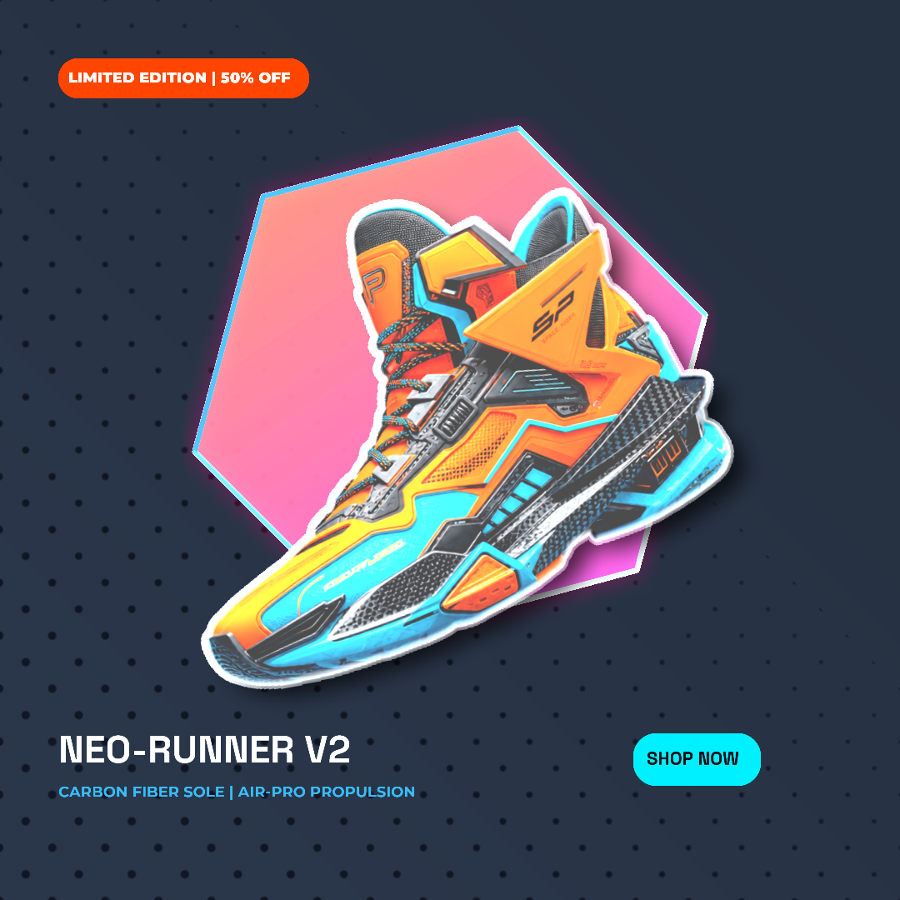

# Gatewai Artifex

A **non-interactive, hardware-accelerated, machine-first CLI for autonomous AI agents** to compose and render media from a JSON spec. Presented by [http://gatewai.studio](http://gatewai.studio)

## Getting Started & Installation

To get started with Artifex, install the agent skills into your AI agent's workspace, and run or install the Artifex CLI.

### 1. Install Artifex Skills (Recommended for AI Agents)
To equip autonomous AI coding agents (such as Antigravity, Claude Code, Cursor, Windsurf, Roo Code, etc.) with Artifex skills, node instructions, and execution workflows, add the skill to your project workspace:
```bash
npx skills add gatewai-dev/artifex-skills --full-depth
```

This installs the complete catalog of node specifications, handle types, edge connection rules, and composition guidelines directly into your agent's context window.

### 2. Global Installation & Execution
To run Artifex globally or on-demand without manual installation, use `npx` or `pnpm dlx`:
```bash
# Run on-demand via npx
npx @gatewai.studio/artifex --help

# Run on-demand via pnpm dlx
pnpm dlx @gatewai.studio/artifex --help
```

Alternatively, you can install it globally to make the `artifex` command available in your shell:
```bash
# Using npm
npm install -g @gatewai.studio/artifex

# Using pnpm
pnpm add -g @gatewai.studio/artifex

# Verify installation
artifex --help
```


## Credentials & Configuration

```bash
# FAL AI  → image / video / speech generation
GATEWAI_FAL_API_KEY=...
# OpenRouter → LLM
GATEWAI_OPENROUTER_API_KEY=...

# Local asset storage directory (defaults to ./gw-assets)
GATEWAI_STORAGE_DIR=./gw-assets

# Concurrency limit for renders (Composition, Still, LUT). Defaults to 2.
GATEWAI_CONCURRENT_RENDERS=2
```

Environment variables take precedence. Alternatively, keys may be placed in a `.env` file or under `~/.config/gatewai/credentials.json`.

## Commands

```
artifex validate <spec>               Parse & validate spec (aggregates ALL schema, node config, edge, & linter errors).
artifex build    <spec>               Build + inspect graph (nodes, order, supported types).
artifex run      <spec>               Execute workflow; print / save results.
artifex init-node <name>              Scaffold a new custom node package.
artifex nodes                        Machine-readable node catalog (metadata: config, key, outputs).
artifex skill    <nodeType>           Print node markdown skill instructions.
artifex version                       Print build + schema version.
artifex help                          Show help.
```

Options:
- `--plugin, --plugins, -p <path>`: Specify custom node package or directory (comma-separated).
- `--dir <path>`: Target directory for init-node scaffolding.
- `--type <name>`: Explicit node type for init-node (e.g. InvertColors).
- `--description <text>`: Description for init-node scaffolding.
- `--category <name>`: Category for init-node scaffolding (default: Media).
- `--json`: Produce machine-readable JSON output on stdout.
- `--node <id>`: Specify target terminal node(s) to run (comma-separated).
- `--state <file>`: Specify path to save CanvasState (results + node IDs).
- `--from-state <file>`: Specify path to load CanvasState from.

## Workflow / canvas state

The CLI is registry-driven: every node type registers its **metadata** (config
schema, required provider key, output types) and **processor** in a NodeRegistry,
and execution auto-picks the processor by type. Metadata drives validation, the
`requiresKey` check, and the `artifex nodes` catalog — so a node's contract and
behavior can't drift.

`run` returns a JSON object (or logs a summary) containing the canvas ID, the map of node ID to its generated result (`results`), and the mapping of spec node IDs to engine node IDs (`nodeIds`).

Checkpoints:
- `--state <file>` persists the CanvasState (results + node IDs) to JSON.
- `run --from-state <file>` loads the cached outputs and runs from the checkpoint —
  **no recompute of FAL/LLM/TTS calls**.
- To prevent execution of specific nodes (especially terminal nodes like `Export`, `VideoGen`, or `ImageGen` which run by default in a full workflow execution), mark them as `"locked": true` in the spec and supply their `"result"` (or load it via `--from-state`). For a terminal node to not run, it must be locked. The runner will skip execution of locked nodes and their upstream dependencies.

## Exit codes

The CLI returns specific exit codes depending on the failure type:
- `0`: SUCCESS - Execution completed successfully.
- `2`: INPUT_ERROR (`E_INPUT`) - Invalid command arguments, missing files, or schema validation failure.
- `3`: GRAPH_ERROR (`E_GRAPH`) - Issues with building the execution graph (e.g., cycles, references to unknown nodes).
- `4`: RENDER_ERROR (`E_RENDER`) - Rendering-specific issues (e.g., missing node outputs, renderer engine failures).
- `5`: PROVIDER_ERROR (`E_PROVIDER_NO_KEY`) - Authentication or missing API key issues for external providers.
- `7`: FATAL_ERROR (`E_FATAL`) - Unhandled or unexpected critical exceptions.

*(Note: Exit code `6` / `TIMEOUT_ERROR` is reserved but not currently produced by the runtime execution loop.)*

## Spec Schema (Zod)

The JSON specification is validated against the following Zod schema definitions:

```typescript
import z from "zod";

export const HandleSpecSchema = z.object({
	label: z.string(),
	dataTypes: z.array(z.string()),
});

export const NodeSpecSchema = z.object({
	id: z.string(),
	type: z.string(),
	name: z.string().optional(),
	position: z
		.object({ x: z.number(), y: z.number() })
		.optional()
		.default({ x: 0, y: 0 }),
	config: z.record(z.string(), z.unknown()).optional().default({}),
	dynamicInputs: z.array(HandleSpecSchema).optional().default([]),
	dynamicOutputs: z.array(HandleSpecSchema).optional().default([]),
	result: z.unknown().optional(),
	locked: z.boolean().optional(),
});

export const EdgeSpecSchema = z.object({
	source: z.string(),
	target: z.string(),
	sourceLabel: z.string().optional(),
	targetLabel: z.string().optional(),
});

export const FontSpecSchema = z.object({
	family: z.string(),
	file: z.string(),
});

export const CanvasSpecSchema = z.object({
	name: z.string(),
	plugins: z.array(z.string()).optional().default([]),
	nodes: z.array(NodeSpecSchema),
	edges: z.array(EdgeSpecSchema).optional().default([]),
	fonts: z.array(FontSpecSchema).optional().default([]),
	canvasId: z.string().optional(),
});
```

### Declarative Local Imports
Instead of specifying complex mock node results for file uploads/imports, you can configure the path to local files directly inside your `Import` nodes:
```json
    {
      "id": "import-1",
      "type": "Import",
      "config": {
        "file": "o/booba-signal-blur.mp4"
      }
    }
```
The CLI dynamically reads the local file, fetches metadata (resolution, duration, FPS, sample rates), and constructs the required node results automatically before execution.


## Spec format example

Below is a complete, validated canvas spec containing `CanvasGenerator`, `Modulate`, `Text`, `LLM`, `ImageGen`, and `Compositor` nodes:

```jsonc
{
  "name": "Creative City Canvas",
  "nodes": [
    {
      "id": "canvas-bg",
      "type": "CanvasGenerator",
      "name": "Base Background Canvas",
      "config": {
        "width": 1280,
        "height": 720,
        "fillType": "solid",
        "solidColor": "#1a1a2e"
      }
    },
    {
      "id": "modulate-1",
      "type": "Modulate",
      "name": "Background Color Adjuster",
      "config": {
        "hue": 180,
        "brightness": 1.2,
        "contrast": 1.0,
        "exposure": 0.0,
        "saturation": 1.5,
        "sepia": 0.0
      }
    },
    {
      "id": "prompt-text",
      "type": "Text",
      "name": "AI Prompter Text",
      "config": {
        "content": "Create a detailed image generation prompt of a futuristic neon city skyline, 1 sentence."
      }
    },
    {
      "id": "llm-1",
      "type": "LLM",
      "name": "Creative Prompt Refiner",
      "config": {
        "model": "google/gemini-3.7-flash"
      }
    },
    {
      "id": "img-1",
      "type": "ImageGen",
      "name": "AI Cityscape Generator",
      "config": {
        "model": "openai/gpt-image-2",
        "openaiSize": "square",
        "openaiQuality": "medium",
        "openaiFormat": "png",
        "openaiBackground": "opaque"
      }
    },
    {
      "id": "comp-1",
      "type": "Compositor",
      "name": "Overlay Compositor",
      "config": {
        "width": 1280,
        "height": 720,
        "backgroundColor": "#000000",
        "layout": [
          {
            "id": "bg-media",
            "kind": "media",
            "inputHandleId": "background",
            "position": "absolute",
            "x": 0,
            "y": 0,
            "width": 1280,
            "height": 720,
            "fit": "cover"
          },
          {
            "id": "overlay-media",
            "kind": "media",
            "inputHandleId": "overlay",
            "position": "absolute",
            "x": 160,
            "y": 90,
            "width": 960,
            "height": 540,
            "fit": "cover"
          }
        ]
      },
      "dynamicInputs": [
        {
          "label": "background",
          "dataTypes": ["Image"]
        },
        {
          "label": "overlay",
          "dataTypes": ["Image"]
        }
      ]
    },
    {
      "id": "export-node",
      "type": "Export",
      "config": {
        "file": "./renders/output.png"
      }
    }
  ],
  "edges": [
    {
      "source": "canvas-bg",
      "target": "modulate-1",
      "sourceLabel": "Result",
      "targetLabel": "Input"
    },
    {
      "source": "prompt-text",
      "target": "llm-1",
      "sourceLabel": "Result",
      "targetLabel": "Prompt"
    },
    {
      "source": "llm-1",
      "target": "img-1",
      "sourceLabel": "Result",
      "targetLabel": "Prompt"
    },
    {
      "source": "modulate-1",
      "target": "comp-1",
      "sourceLabel": "Result",
      "targetLabel": "background"
    },
    {
      "source": "img-1",
      "target": "comp-1",
      "sourceLabel": "Result",
      "targetLabel": "overlay"
    },
    {
      "source": "comp-1",
      "target": "export-node",
      "sourceLabel": "Result",
      "targetLabel": "Input"
    }
  ]
}
```

## Supported node types

For the complete, catalog of all supported workflow canvas nodes (with their config schemas, inputs, outputs, and keys): [https://gatewai.studio](https://gatewai.studio)

Alternatively, query the catalog directly using the CLI:
```bash
artifex nodes --json
```

## Production Examples & Blueprints

Explore production-grade, executable workflow specifications in the [`examples/`](./examples) directory:

### 01: Luxury Real Estate Commercial Video Ad
> **Traditional Agency Cost:** $1,500 – $4,500 per listing pack • **Format:** 16:9 1080p MP4
>
> End-to-end listing tour featuring OpenAI medium-quality architectural generation, CMYK selective color sky/foliage enhancement, S-curve contrast grading, KenBurns camera glide, Gemini narration, Whisper subtitle synchronization, and luxury Cinzel typography.

<video src="./examples/01-luxury-real-estate-video-ad/output.mp4" controls width="100%"></video>

[View Specification & Architecture](./examples/01-luxury-real-estate-video-ad)

### 02: High-Converting E-Commerce Product Card
> **Traditional Agency Cost:** $75 – $250 per creative asset • **Format:** 1:1 1080x1080 PNG
>
> Automated DTC promotional ad banner featuring OpenAI sneaker synthesis, AI alpha cutout extraction, sub-pixel edge defringing, parametric vector hexagon shape plate with neon glow/bevel, pop-art halftone screening, and Space Grotesk / Montserrat typography.



[View Specification & Architecture](./examples/02-ecommerce-product-card)

### 03: Faceless History Cash-Cow Short
> **Traditional Agency Cost:** $75 – $250 per short video • **Format:** 9:16 1080x1920 MP4
>
> High-retention vertical short featuring Gemini humorous scriptwriting, 5 consecutive OpenAI oil painting scenes (The 1932 Great Emu War), golden-age split-toning, 5 custom KenBurns camera trajectories, 35mm grain, Charon narration, and Whisper captions.

<video src="./examples/03-faceless-cash-cow-short/output.mp4" controls width="100%"></video>

[View Specification & Architecture](./examples/03-faceless-cash-cow-short)

### 04: Vintage Print Editorial Motion Poster
> **Traditional Agency Cost:** $250 – $750 per poster series ($500 – $1,200 motion graphics) • **Format:** 3:4 1080x1440 MP4 @ 24fps
>
> Physical-fidelity 4-color CMYK offset lithography screening (accurate 15°/75°/0°/45° rosette angles), isolated kimono fabric wave displacement with ProceduralSignal hue oscillation, ink saturation adjustments, archival paper absorption response curves, and Swiss modernist typography.

<video src="./examples/04-vintage-print-editorial-poster/output.mp4" controls width="100%"></video>

[View Specification & Architecture](./examples/04-vintage-print-editorial-poster)

### 05: AI Podcast Audiogram Visualizer (64s Episode)
> **Traditional Agency Cost:** $100 – $300 per clip ($400 – $1,200 full episode visualizer) • **Format:** 1:1 1080x1080 MP4
>
> 64-second multi-modal podcast repurposing pipeline in a refined Ivory Light Theme featuring a Seedance 2.5 talking female avatar host (0–4s intro and 60.2–64.2s outro), 7 middle KenBurns AI infographic/architecture scenes (4–60.2s), soft ivory tone curve calibration, speaker badges, and synchronized subtitles.

<video src="./examples/05-podcast-audiogram-visualizer/output.mp4" controls width="100%"></video>

[View Specification & Architecture](./examples/05-podcast-audiogram-visualizer)

---

Artifex is the execution runtime for AI-authored media workflows — not merely a
renderer. An agent can describe a composition as a graph, ask Artifex to validate
it, execute only the necessary nodes, inspect the resulting artifacts, and export
the final work without driving the Studio UI or learning backend internals.

That boundary gives agents a dependable production loop:

```text
workflow spec → validation → execution → inspectable artifacts → export
```

### What this gives an agent

- **A machine-executable media contract.** Nodes, configuration, handles,
  dependencies, and export targets live in one portable JSON document.
- **Early, actionable failures.** Schema, graph, input, provider, and renderer
  failures are separated by coded exits instead of being hidden in terminal prose.
- **Selective execution.** Run the whole graph or target a node while preserving
  upstream dependencies and cached results.
- **Safe checkpoints.** State files let an agent resume work, export another
  target, or revise a composition without repeating expensive generation calls.
  State includes a workflow fingerprint so stale results are not silently applied
  to a different spec.
- **Inspectable intermediate work.** Images, audio, video, text, filters, and
  compositions remain visible as node results, allowing an agent to make a useful
  decision before committing to the next expensive step.

### GPU-first execution

Artifex is designed around local hardware-accelerated rendering. The GPU is part
of the rendering path for visual composition and supported media operations, so a
generic CPU-only CI pipeline is not the primary deployment model. For repeatable
automation, run Artifex on a machine with the required graphics stack and treat
GPU availability as an execution prerequisite rather than falling back silently.

The practical production shapes are:

- a developer workstation or GPU runner that executes a spec and writes artifacts;
- a long-lived worker pool with known GPU capabilities;

This keeps expensive provider calls, local rendering, and final export explicit:
agents can validate and plan freely, while execution remains observable,
resumable, and controllable.

## Custom Nodes & Local Plugins

Artifex allows developers and AI agents to author, scaffold, and execute custom node packages directly from the local filesystem.

### 1. Scaffold a Custom Node
```bash
artifex init-node node-my-filter --type MyFilter --category Media
```
Creates a complete TypeScript package structure with `src/metadata.ts`, `src/server/processor.ts`, `src/renderers/webgpu-renderer.ts`, and `SKILL.md`.

### 2. Include in Spec
```json
{
  "name": "Custom Pipeline",
  "plugins": ["./node-my-filter"],
  "nodes": [
    { "id": "input", "type": "CanvasGenerator", "config": { "width": 512, "height": 512 } },
    { "id": "effect", "type": "MyFilter", "config": { "strength": 3 } },
    { "id": "export", "type": "Export", "config": { "file": "./out.png" } }
  ],
  "edges": [
    { "source": "input", "target": "effect" },
    { "source": "effect", "target": "export" }
  ]
}
```

### 3. Run or Validate with CLI
```bash
artifex validate spec.json --plugin ./node-my-filter
artifex run spec.json
```

## Dev

```bash
pnpm --filter @gatewai.studio/artifex test        # unit tests (vitest)
pnpm --filter @gatewai.studio/artifex typecheck
pnpm --filter @gatewai.studio/artifex build
pnpm check:cli-deps                     # dependency + emission guard (H1/H1b/H3)
```

## LICENSE

Proprietary. Not open source **yet**.
