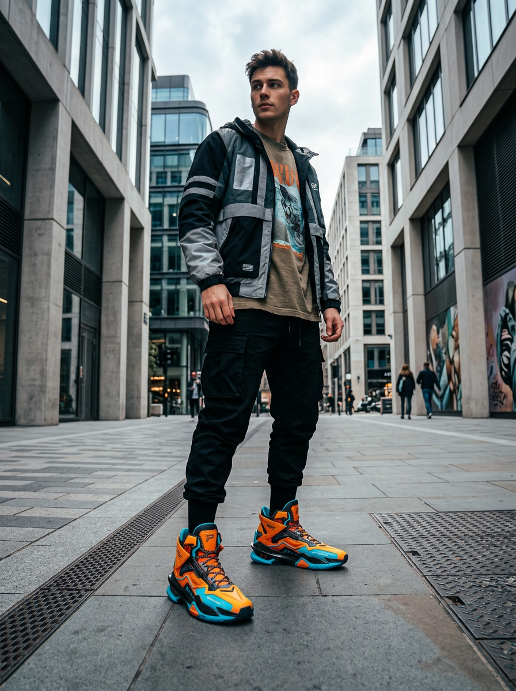

# Example 06: Cross-Spec Streetwear Lookbook Editorial

An automated fashion lookbook and creative advertising pipeline demonstrating **multi-spec asset re-use**: taking the rendered ad creative from **Example 02** (`../02-ecommerce-product-card/output.png`) as a reference input image to generate a high-end streetwear lifestyle editorial photograph with an athletic model wearing the exact sneakers from the ad creative.



---

## 🎬 Pipeline Architecture

```mermaid
graph TD
    IMP[Import (Example 02 output.png: High-Top Sneaker)] -->|Reference Image| IG[ImageGen (fal-ai/nano-banana-2 Edit)]
    P[Lookbook Photoshoot Prompt] -->|Prompt| IG
    
    IG --> SC[SelectiveColor (Streetwear Tonal Pop & Cyan Calibration)]
    SC --> FG[FilmGrain (Subtle 35mm Analog Texture)]
    FG --> EXP[Export (.png)]
```

---

## 🛠 Nodes & Techniques Demonstrated

1. **`Import` (Cross-Spec Asset Connection)**: Loads the rendered output artifact from a preceding spec (`../02-ecommerce-product-card/output.png`), automatically reading dimensions, color profile, and media metadata.
2. **`Text` (Art Direction Prompt)**: Formulates specific framing instructions (full body perspective, streetwear wardrobe, low-angle camera, natural city lighting).
3. **`ImageGen` (Reference Image Conditioning)**: Uses `fal-ai/nano-banana-2` conditioned on the imported sneaker image (`aspect_ratio: "3:4"`, `resolution: "1K"`), transferring the sneaker silhouette, electric orange accents, cyan details, and sole structure onto the model's feet.
4. **`SelectiveColor`**: Commercial CMYK color grading to enhance urban shadows, sharpen asphalt contrast, and enrich the sneaker's electric orange and cyan accents.
5. **`FilmGrain`**: Adds physical 35mm fine grain (`strength: 12`, `size: 1.2`, `monochrome: true`) to avoid the artificial plastic smoothness typical of raw AI renders.
6. **`Export`**: Deterministically writes the finished high-resolution editorial photograph to disk.

---

## 🚀 Execution Guide

### Validate the Spec
```bash
artifex validate examples/06-cross-spec-product-lookbook/spec.json
```

### Inspect the Execution Graph
```bash
artifex build examples/06-cross-spec-product-lookbook/spec.json
```

### Run and Render
```bash
artifex run examples/06-cross-spec-product-lookbook/spec.json --state checkpoint.json
```
Output is saved to `scratch-renders/cross-spec-lookbook-editorial.png`.
